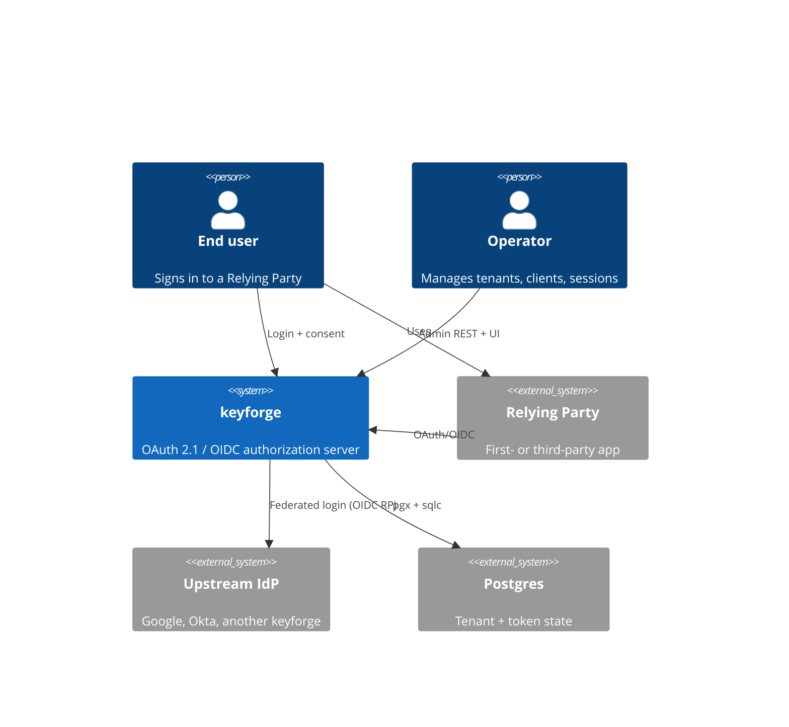
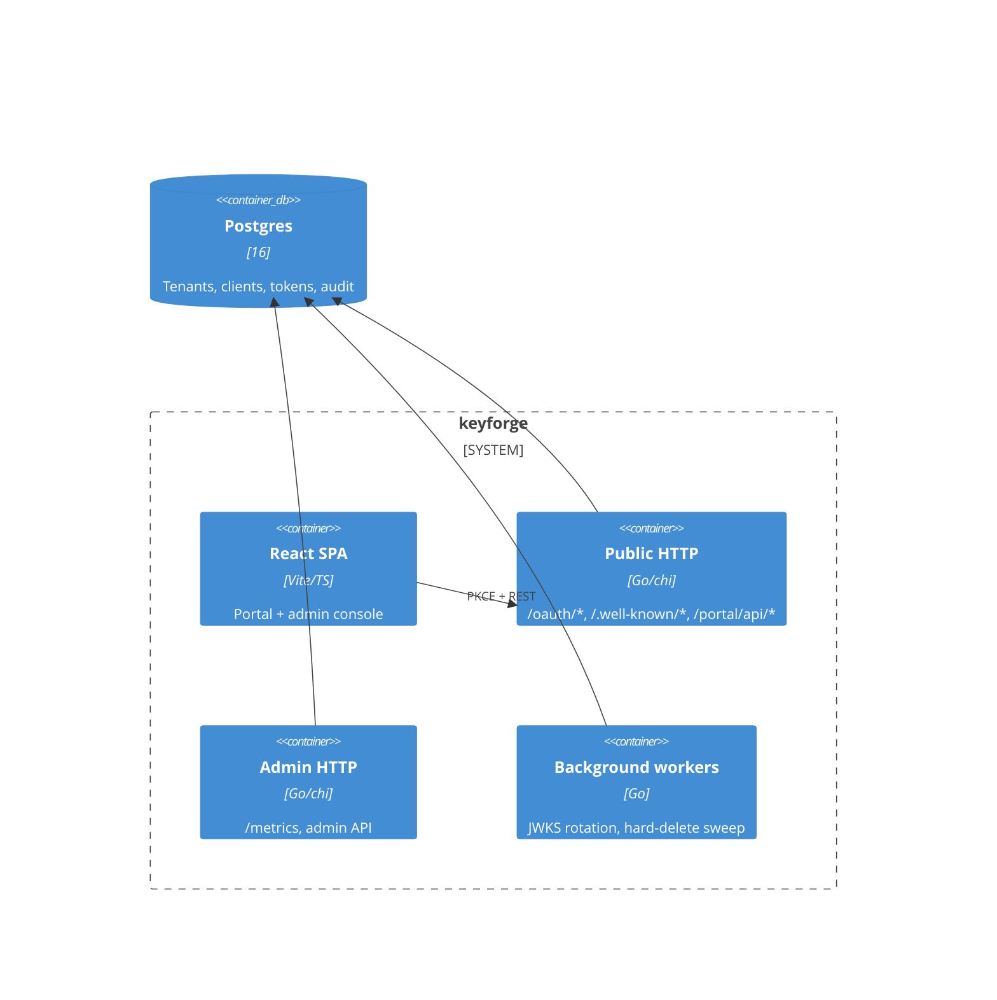
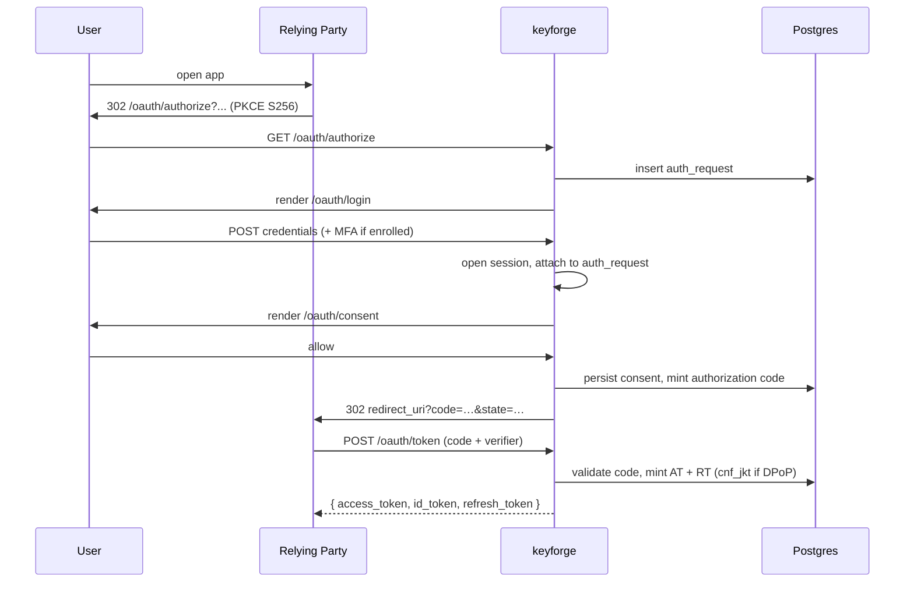

# Architecture

## C4 — System context

## Container view

## Authorization Code + PKCE (sequence)

## Hybrid token model

- **Access tokens** are opaque (`kf_at_<base64url>`); SHA-256 hash stored
  in `access_tokens`. Instantly revocable.
- **ID tokens** are JWTs signed by the active JWKS key.
- **Refresh tokens** are opaque, rotated on every grant. Presenting a
  consumed RT (inside a SERIALIZABLE tx) revokes the entire family —
  proven by `tokens` integration test.

## Multi-tenancy

Every domain table carries `tenant_id`. The `internal/storage` package
exposes `postgres.ContextWithTenant` / `MustTenant`; the build-time
`tenantguard_test.go` fails any sqlc query that touches a tenant-owned
table without `WHERE tenant_id` (or the explicit `-- tenantguard:
global-ok` opt-out comment with a reason).
